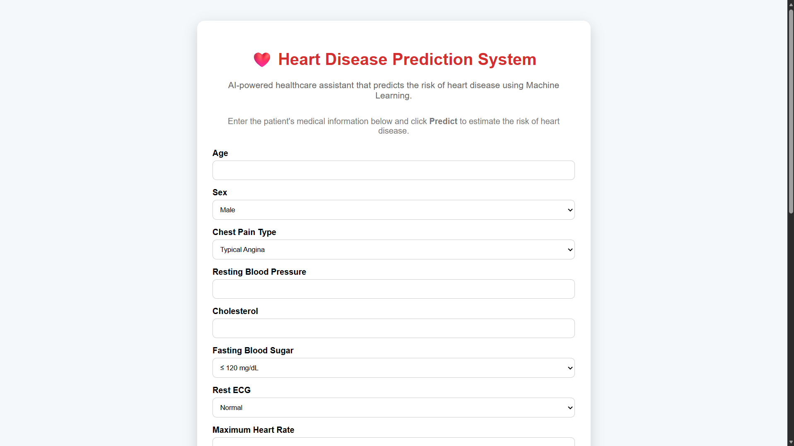
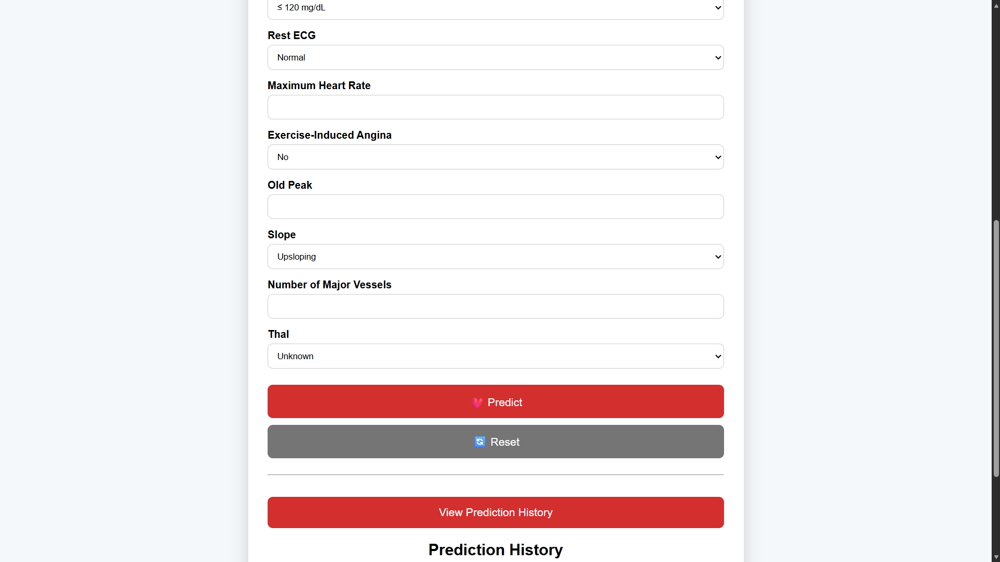
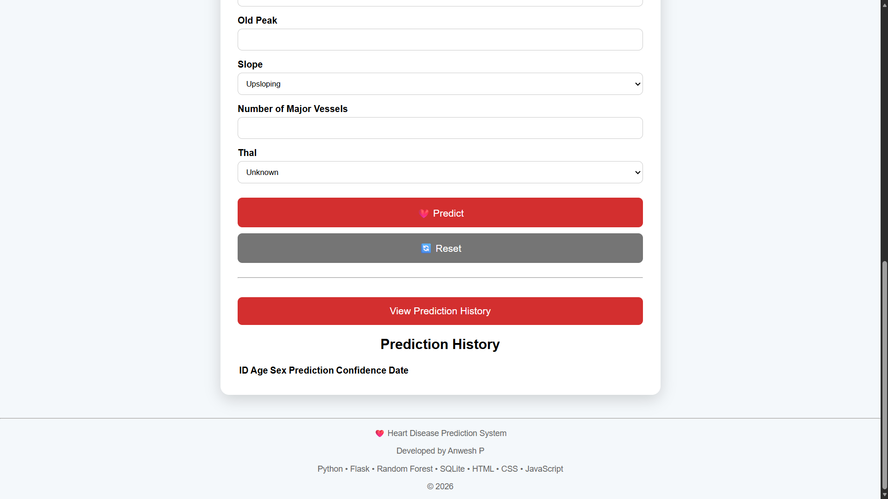
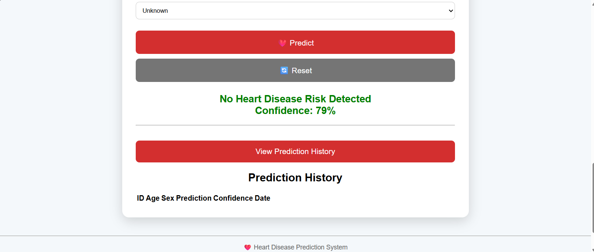
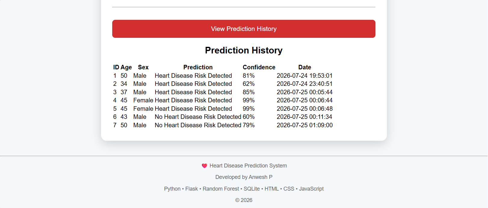

# ❤️ Heart Disease Prediction System

An AI-powered web application that predicts the risk of heart disease using Machine Learning.

## 🚀 Features

- Machine Learning based prediction
- Random Forest classification model
- User-friendly web interface
- Confidence score display
- Prediction history storage
- Flask REST API backend
- Responsive healthcare dashboard

## 🧠 Machine Learning

### Algorithm Used:
Random Forest Classifier

### Dataset:
UCI Heart Disease Dataset

### Dataset Size:
303 patient records

### Model Accuracy:
83.6%

## 🛠️ Technologies Used

### Backend:
- Python
- Flask
- Scikit-learn
- Pandas
- NumPy

### Frontend:
- HTML
- CSS
- JavaScript

### Database:
- SQLite

## 📂 Project Structure

## 📸 Screenshots

### Homepage

### Prediction Result

### Prediction History
